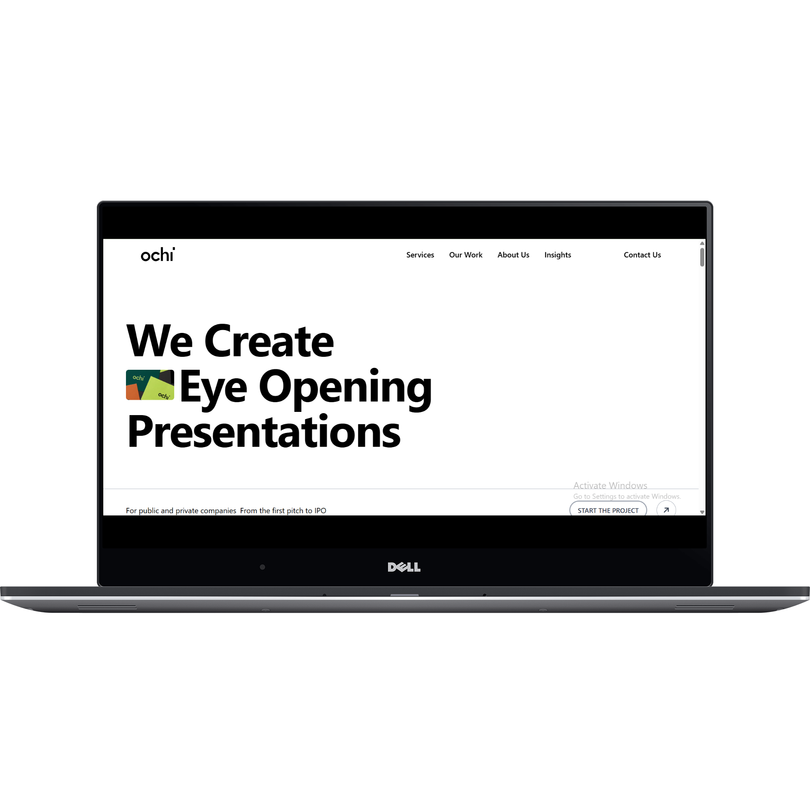

# 🌐 Ochi.Design Clone

## About Project
A fully responsive clone of [Ochi.design](https://ochi.design/) built with **React.js**, **Tailwind CSS**, and **Framer Motion**. This project showcases modern frontend development techniques, smooth animations, and a clean UI inspired by a real-world creative agency site.

---

## 🚀 Live Demo

👉 [View Live Site](https://ochi-replica.vercel.app/)

---

## 🧠 Tech Stack

- **React.js** – JavaScript library for building user interfaces  
- **Tailwind CSS** – Utility-first CSS framework  
- **Framer Motion** – Library for animation and gesture support in React  

---

## 📱 Features

- 🎯 Pixel-perfect UI inspired by Ochi.design  
- 📱 Fully responsive layout for all screen sizes  
- 🎥 Smooth animations using Framer Motion  
- ⚡ Fast performance and optimized layout  
- 💻 Clean and maintainable component-based structure

---

## 🎯 Purpose

This project was built as part of a frontend learning journey and portfolio building. It focuses on:

- Practicing responsive design with Tailwind  
- Integrating advanced animation using Framer Motion  
- Enhancing real-world development workflow with React  

---

## 🛠️ Getting Started

### 📋 Prerequisites

- Node.js (v14 or newer)
- npm or yarn

### 🔧 Installation

git clone https://github.com/Zartasha-kanwal/ochi-replica.git

cd ochi-clone

npm install

npm start
